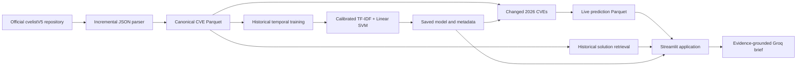

# VulnScope

VulnScope is a continuously updated CVE analysis system that combines data engineering, temporal machine learning, explainable predictions, historical evidence retrieval, and an LLM-assisted analyst interface.

Its model answers one deliberately narrow question:

> From a CVE's title and description, does it look likely to receive a CVSS base score of **7.0 or higher** (High or Critical)?

VulnScope predicts **technical severity**, not exploitation, breach likelihood, or organization-specific risk.

## Why this is useful

For an older CVE that already has a complete CVSS assessment, the official score is more useful than a model prediction. VulnScope is intended for the gap between publication and structured scoring: a new CVE may have descriptive text before it has a CVSS score, so the model can provide an early prioritization signal while analysts wait for authoritative scoring.

Historical scored CVEs serve three purposes:

1. They teach the model which language is associated with High/Critical CVSS outcomes.
2. They provide a future-year test that measures whether the signal generalizes over time.
3. They supply comparable cases and documented historical solutions for the analyst agent.

The product keeps this distinction visible:

- **CVSS missing:** the model is an early severity estimate.
- **CVSS available:** the official score is authoritative; the prediction is useful for validation and demonstration.
- **CISA KEV:** useful external evidence, but not the target of this model.

## Results

The selected operating threshold was chosen on 2024 validation data and then evaluated once on unseen 2025 CVEs.

| Metric | 2025 temporal test |
|---|---:|
| CVEs evaluated | 45,198 |
| Severe CVEs | 19,876 (44.0%) |
| Precision | 0.633 |
| Recall / coverage | 0.805 |
| F1 | 0.708 |
| PR-AUC | 0.764 |
| Brier score | 0.178 |
| Decision threshold | 0.352 |

At this threshold, VulnScope catches approximately four out of five severe CVEs. About 63% of its alerts are actually High/Critical. This favors coverage because missing a severe vulnerability can be more costly than reviewing additional candidates.

The Brier score is a probability-error measure, not an accuracy percentage; lower is better.

## System design



### Data pipeline

- Synchronizes with the official `cvelistV5` Git repository.
- Flattens nested JSON into one row per CVE.
- Preserves publication, update, and reservation timestamps.
- Detects changed source files using Git revisions.
- Parses and merges only new or modified records.
- Writes the canonical dataset as compressed Parquet.
- Scores only changed, published 2026 CVEs.
- Uses atomic writes and validates schemas and duplicate identifiers before replacement.

Parquet is used because it is compressed, column-oriented, typed, and much faster than repeatedly parsing hundreds of thousands of nested JSON files. The application reads only the columns it needs to stay within deployment memory limits.

### Temporal model design

| Period | Purpose |
|---|---|
| 2020–2023 | Model fitting |
| Jan–Jun 2024 | Probability calibration |
| Jul–Dec 2024 | Alert-threshold selection |
| 2025 | Untouched temporal test |
| 2026 | Live scoring |

Splits use the actual publication timestamp, not the year embedded in the CVE identifier. CVEs can be reserved in one year and published later.

### Model

The saved model is a calibrated text-classification pipeline:

1. The CVE title and description are combined.
2. TF-IDF converts words and short phrases into numerical features.
3. A linear SVM learns the boundary between below-7 and High/Critical historical CVEs.
4. Calibration converts the classifier output into an estimated probability.
5. The 2024-selected threshold converts that probability into `Flagged` or `Not flagged`.

Only `title` and `description` are predictors. CVSS score, vector components, and recorded severity are used only to construct historical labels.

The following fields are quarantined from training because they may contain later knowledge or direct evidence related to exploitation:

- CISA ADP/SSVC fields
- SSVC exploitation, automation, impact, and timestamp fields
- exploit-reference indicators

## Why KEV is not the target

CISA Known Exploited Vulnerabilities was evaluated as a possible exploitation label. It is authoritative for the vulnerabilities it contains, but absence from KEV does not prove that a vulnerability was never exploited. Treating every non-KEV CVE as a negative would create a positive–unlabeled learning problem and produced very few known positives.

For that reason, the current project retains KEV as external context and keeps the modeling claim narrower and more defensible: early prediction of a High/Critical CVSS profile.

## The VulnScope agent

The Streamlit interface is a constrained analysis agent rather than a general chatbot. It coordinates deterministic tools and keeps the ML score separate from the LLM narrative.

It can:

- Search by CVE ID, vendor, product, CWE, or natural-language terms.
- Retrieve a complete CVE record.
- Return a saved or on-demand severity prediction.
- Explain which text terms pushed the model upward or downward.
- Compare up to ten CVEs.
- Show recently flagged 2026 CVEs.
- Retrieve similar earlier CVEs with documented solutions.
- Generate a Groq analyst brief grounded in the record, prediction, model explanation, and retrieved evidence.

The LLM does **not** invent the severity probability, patch status, or supporting evidence. The trained model produces the score; retrieval supplies historical evidence; Groq organizes those inputs into readable analysis.

## Streamlit application

The application contains five views:

1. **Search & analyze** — search the CVE corpus and inspect a selected prediction.
2. **Analyst brief** — retrieve historical evidence and optionally generate a Groq summary.
3. **Compare CVEs** — compare probabilities and metadata across multiple records.
4. **Recent alerts** — review the newest flagged 2026 CVEs and pipeline status.
5. **Data & monitoring** — inspect freshness, completeness, volume, probability distribution, flagged vendors/CWEs, and saved evaluation metrics.

## Interesting data findings

- Published CVE volume rises substantially in recent years. This reflects changes in reporting participation and backlog processing as well as vulnerability incidence.
- Older CVEs frequently lack vendors and products in modern structured fields. This does not mean older vulnerabilities had no affected vendor.
- Structured solution objects remain sparse because remediation is often recorded in external advisories.
- CWE completeness changes depending on whether extraction is limited to the CNA problem-type field or searches later enrichment containers.
- The mixture of CVSS versions and assigning organizations changes over time, creating dataset shift.
- Some CVE reservation timestamps occur after publication. These are preserved as source-data anomalies, but reservation duration is not used as a feature.
- Large product or reference counts can represent genuine ecosystem-wide vulnerabilities and should not be deleted automatically as outliers.

The complete, executed analysis is available in [`notebooks/01_vulnscope_end_to_end_analysis.ipynb`](notebooks/01_vulnscope_end_to_end_analysis.ipynb). It combines data-quality analysis, temporal EDA, baseline comparison, coverage-versus-efficiency analysis, leakage checks, subgroup results, and error review.

## Project structure

```text
VulnScope/
├── app.py                              # Streamlit interface
├── artifacts/
│   ├── cve_priority_model.joblib       # Saved calibrated model
│   └── cve_priority_model_metadata.json
├── data/
│   ├── processed/cves_clean.parquet    # Canonical CVE table
│   ├── predictions/                    # Live 2026 predictions
│   ├── raw/cvelistV5/                  # Local upstream checkout
│   └── state/                          # Incremental ingestion revision
├── notebooks/
│   └── 01_vulnscope_end_to_end_analysis.ipynb
├── reports/
│   ├── cve_priority_model/             # Metrics, errors, and plots
│   └── ingestion/                      # Latest pipeline reports
├── src/
│   ├── profile_cve_data.py             # JSON flattening and profiling
│   ├── train_cve_priority_model.py      # Training and evaluation
│   ├── update_cve_data.py              # Incremental ingestion
│   ├── score_changed_cves.py            # Incremental live scoring
│   ├── run_live_update.py               # Update + scoring workflow
│   └── vulnscope_service.py             # Agent tools and Groq integration
└── tests/                               # Service and pipeline tests
```

## Run locally

Python 3.11 or 3.12 is recommended.

```bash
git clone <your-repository-url>
cd VulnScope
python -m venv .venv
source .venv/bin/activate
pip install -r requirements.txt
streamlit run app.py
```

The application can run without Groq for searching, scoring, explanations, comparisons, evidence retrieval, alerts, and monitoring.

To enable generated analyst briefs:

```bash
cp .env.example .env
```

Then set:

```text
GROQ_API_KEY=your_key
GROQ_MODEL=openai/gpt-oss-20b
```

Never commit the real `.env` file or API key.

## Update the CVE data

The full incremental workflow is:

```bash
python src/run_live_update.py
```

It performs a fast-forward pull of the local `cvelistV5` checkout, identifies changed CVE JSON files, updates the canonical Parquet, and scores changed 2026 records.

To create the upstream checkout when it is not already present:

```bash
git clone https://github.com/CVEProject/cvelistV5.git data/raw/cvelistV5
```

The current desktop setup schedules this command daily. A Streamlit deployment does not automatically run that local schedule: production freshness requires a persistent scheduled worker or CI workflow that updates the deployed data artifacts.

## Train the model

```bash
python src/train_cve_priority_model.py
```

Training regenerates the saved model, metadata, evaluation reports, plots, and initial 2026 prediction file. Model performance should be reported from the untouched 2025 temporal test—not from the training or threshold-selection periods.

## Tests

```bash
pytest -q
```

Tests cover service behavior, search, predictions, evidence retrieval constraints, and incremental pipeline safety.

## Deployment notes

For Streamlit Community Cloud:

1. Deploy `app.py` from the repository root.
2. Ensure the model, metadata, canonical Parquet, live prediction Parquet, and report files are present in the deployed repository or downloaded during startup.
3. Add `GROQ_API_KEY` and optionally `GROQ_MODEL` through Streamlit Secrets/environment configuration.
4. Keep the API key out of Git.
5. Run ingestion outside Streamlit and publish updated artifacts through an authorized deployment workflow.

## Limitations

- The target is eventual CVSS severity, not exploitation probability.
- CVSS is a technical-severity standard, not an organization-specific risk score.
- The canonical CVE table is a latest-state snapshot. Text may have been edited after initial publication, so the present evaluation does not yet prove that every predictor was available at the exact first-publication moment.
- Reconstructing title and description from Git history at publication time is the strongest next leakage-control improvement.
- Reporting practices, CNA composition, CVSS versions, and field completeness change over time.
- Historical solutions are retrieved as precedent, not guaranteed remediation for the current CVE.
- LLM output must remain grounded in retrieved evidence and should be reviewed by a human analyst.

## Responsible interpretation

VulnScope is a prioritization and research tool. A flag means that the CVE text resembles historically High/Critical vulnerabilities at the selected operating threshold. It does not establish active exploitation, affected organizational assets, patch urgency, or business impact. Operational decisions should combine authoritative CVSS data, vendor advisories, CISA KEV, exposure information, asset criticality, and analyst judgment.

